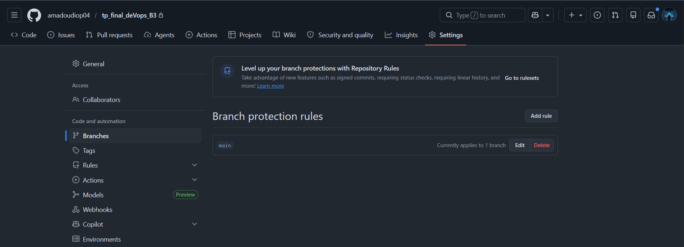
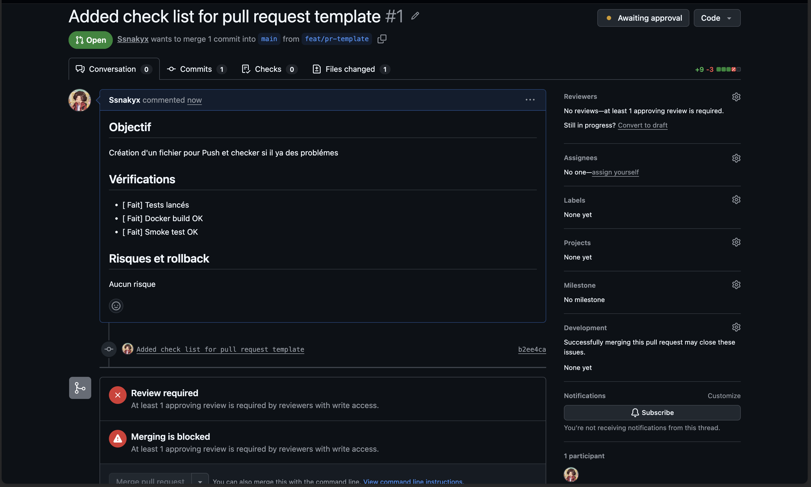
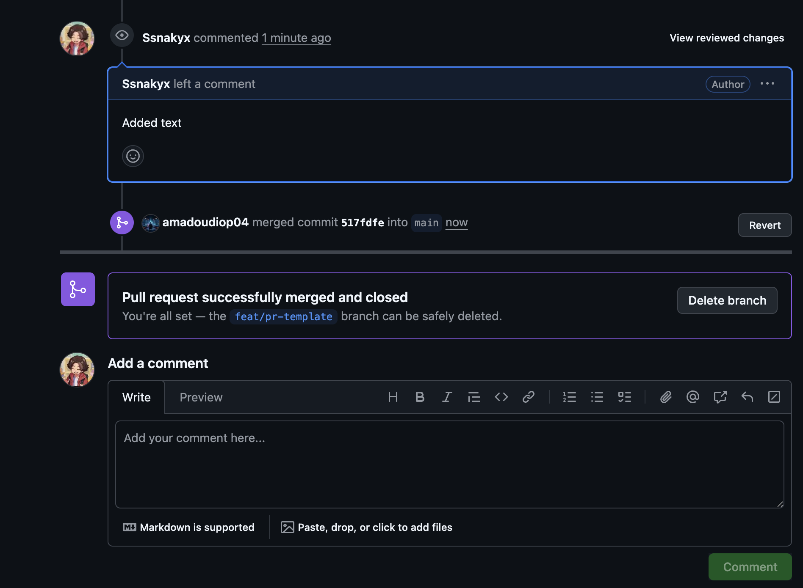
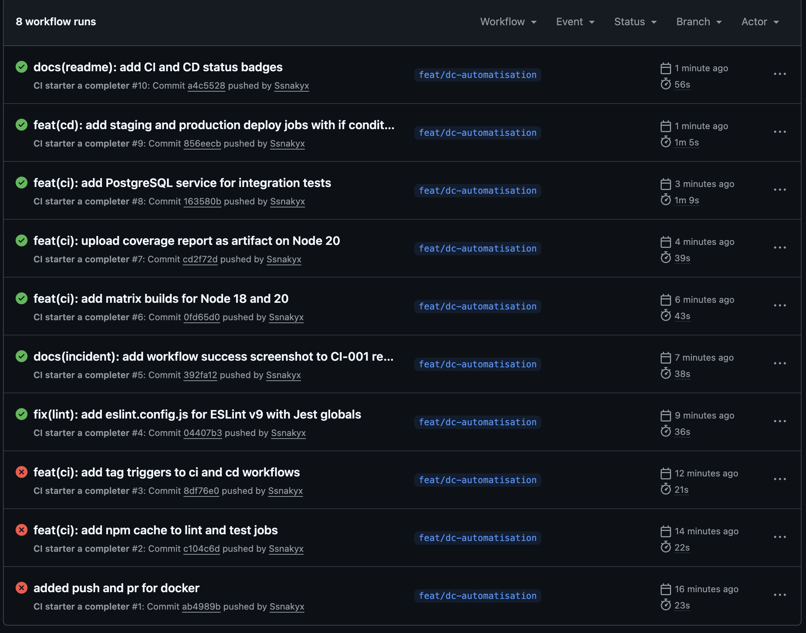
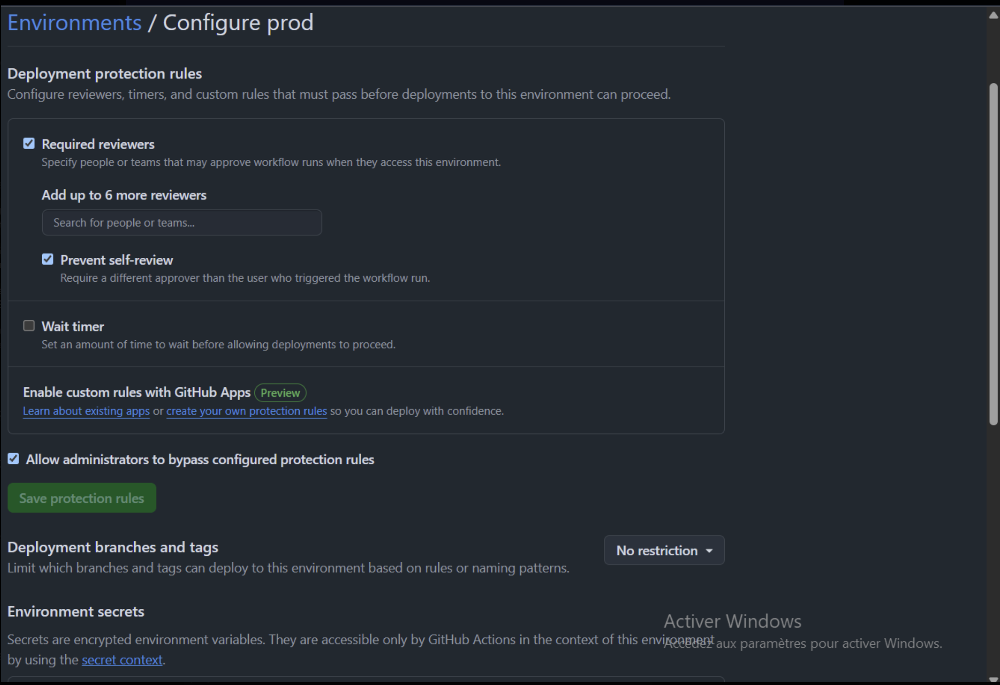
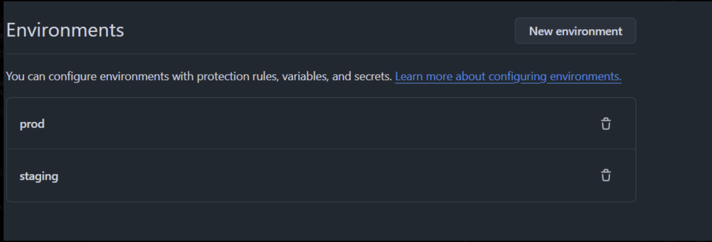
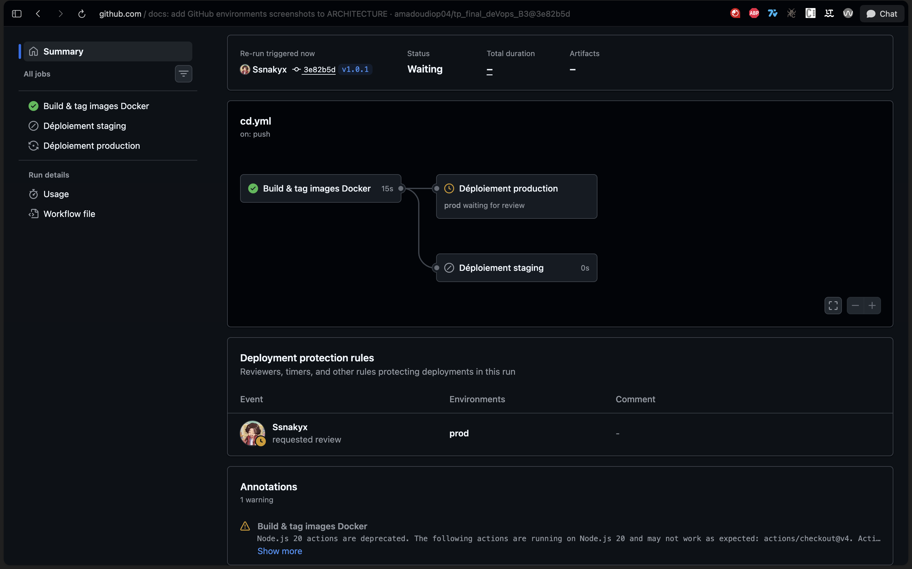
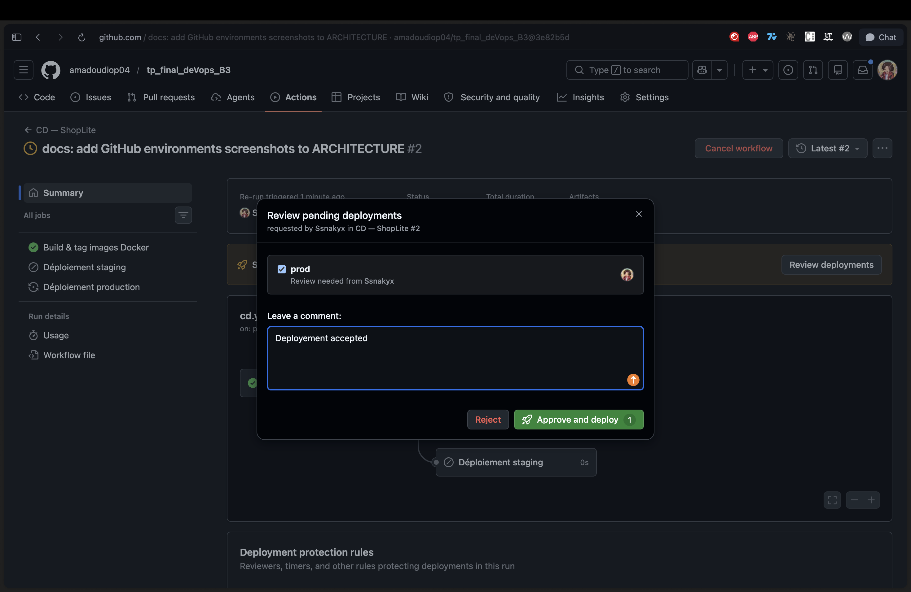
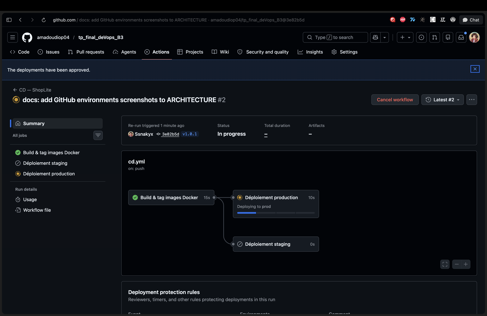

# Architecture du projet — ShopLite

## 1. Protection de la branche `main`

La branche `main` est protégée sur GitHub. On ne peut pas y pousser directement : toute modification passe obligatoirement par une Pull Request.

Pour qu'une PR puisse être mergée, il faut :
- Au moins une approbation d'un autre membre
- Que tous les tests CI soient passants
- Que la branche soit à jour avec `main`



---

## 2. Template de Pull Request

Quand on ouvre une PR, un formulaire se remplit automatiquement. Il demande de décrire ce que fait la PR, de cocher une checklist de vérifications et d'indiquer comment annuler si quelque chose se passe mal.

Ça évite les PR ouvertes à la va-vite sans contexte.



---

## 3. Merge d'une Pull Request

Une fois la PR approuvée et les tests verts, le merge est autorisé. GitHub fusionne la branche dans `main` et propose de supprimer la branche source.



---

## 4. Pipeline CI — Tests et qualité

Le workflow `ci.yml` se déclenche à chaque push et à chaque PR. Il fait tourner plusieurs vérifications en parallèle :

- **Lint** : vérifie que le code respecte les règles ESLint et Prettier
- **Tests unitaires** : Jest avec une couverture minimum de 80%
- **Tests d'intégration** : sur une vraie base PostgreSQL, avec un cycle incident/rollback simulé
- **Audit de sécurité** : `npm audit` pour détecter les dépendances vulnérables

Si une étape échoue, le merge est bloqué.



---

## 5. Environnements — Dev, Staging, Production

Le projet tourne en 3 environnements complètement isolés, chacun avec sa propre base de données et son propre port.

### URLs locales

| Environnement | URL locale | Port app | Port DB |
|---|---|---|---|
| **Dev** | http://localhost:8080 | 8080 | 5433 |
| **Staging** | http://localhost:8081 | 8081 | 5434 |
| **Production** | http://localhost:8082 | 8082 | 5435 |

### Lancer un environnement

- **Dev** : `docker compose up -d`
- **Staging** : `docker compose -f docker-compose.yml -f docker-compose.staging.yml up -d`
- **Production** : `docker compose -f docker-compose.yml -f docker-compose.prod.yml up -d`

Chaque environnement a sa propre base de données (`shoplite`, `shoplite_staging`, `shoplite_prod`) pour éviter tout conflit entre les données.

Les environnements `staging` et `prod` sont configurés dans GitHub :



La protection de l'environnement `prod` avec l'approbation obligatoire :



---

## 6. Pipeline CD — Déploiement et tags Docker

Le workflow `cd.yml` se déclenche selon la branche ou le tag :

- **Push sur `Dev`** → déploiement automatique en staging
- **Push d'un tag `v*`** → staging puis production, avec **approbation manuelle obligatoire**

**Étape 1 — Build des images**
Les images Docker sont construites avec deux tags chacune : `:latest` et `:v1.0.0`. La version vient directement du tag Git.

**Étape 2 — Staging**
La stack staging démarre sur le port `8081`, un smoke test vérifie que l'API répond, puis la stack est arrêtée.

**Étape 3 — Production**
Le job attend une approbation manuelle dans GitHub avant de continuer. C'est configuré dans **Settings → Environments → prod → Required reviewers**.

```
Dev branch  →  build-images  →  deploy-staging
tag v*      →  build-images  →  deploy-staging  →  deploy-prod (approbation requise)
```

### Validation manuelle en action

Quand un tag `v*` est poussé, le job production se met en pause et attend qu'un reviewer approuve :



Le reviewer voit une fenêtre d'approbation avec un champ commentaire :



Une fois approuvé, le déploiement reprend automatiquement :


