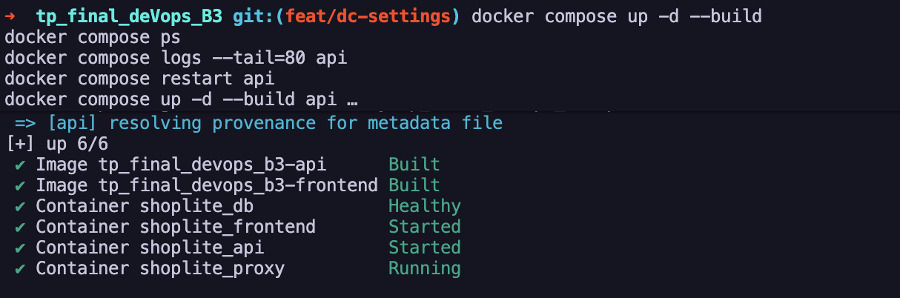
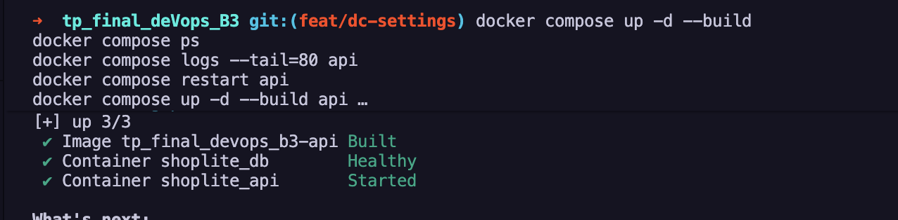
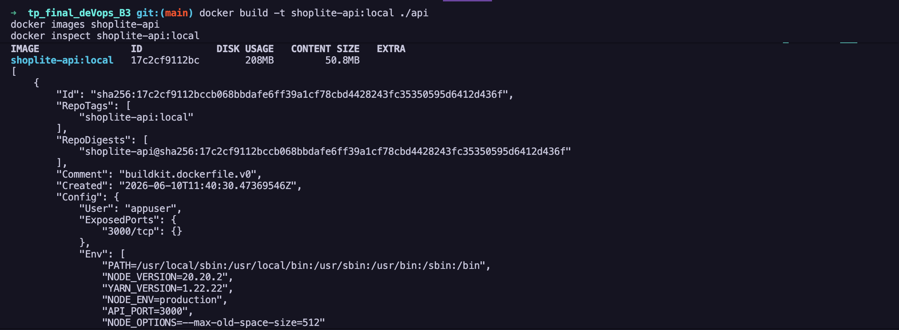
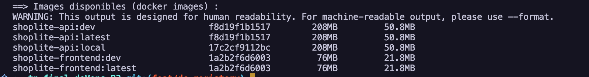

# Rapport DORA — ShopLite

## 1. Les Dockerfiles

### API (`api/Dockerfile`)

Le Dockerfile de l'API utilise un **build en deux étapes** :

- La première étape installe uniquement les dépendances de production.
- La deuxième étape copie le résultat et crée l'image finale, sans npm ni outils inutiles.

Pour la sécurité, l'application ne tourne pas en root : un utilisateur `appuser` est créé et utilisé à la place. Un healthcheck vérifie toutes les 30 secondes que l'API répond bien sur `/health`.

### Frontend (`frontend/Dockerfile`)

Le frontend est servi par Nginx. Le Dockerfile copie les fichiers statiques et la configuration Nginx, puis ajoute un healthcheck sur la racine `/`.

---

## 2. Docker Compose

### Démarrage

`docker compose up -d --build` construit les images et démarre les 4 services : base de données, API, frontend et proxy.

La base de données démarre en premier grâce au `depends_on`, pour éviter que l'API se connecte à une base pas encore prête.

### État des services

Une fois démarrés, les services communiquent entre eux via un réseau interne. Seul le proxy est accessible depuis l'extérieur sur le port `8080`.

### Staging

Un fichier `docker-compose.staging.yml` surcharge la configuration de base pour l'environnement de staging : version différente et port `8081`. Les autres services restent identiques.

---

## 3. Inspection des images Docker

### Avant les tags versionnés

On pouvait déjà inspecter une image locale avec `docker inspect` pour vérifier sa configuration (port exposé, commande de démarrage, variables d'environnement).

---

## 4. Registry et tags Docker

### Pourquoi tagger les images ?

Sans tag, toutes les images s'appellent `latest` et on ne sait plus quelle version correspond à quel déploiement. Tagger permet de retrouver une version précise, de faire un rollback et de savoir exactement ce qui tourne en production.

### Labels sur les images

Chaque image embarque maintenant des informations : la version, le commit Git exact et la date de build. Ces infos sont lisibles avec `docker inspect` sans avoir à ouvrir le code.

### Tags produits

Quand on build avec le script `scripts/build-and-tag.sh`, chaque image reçoit deux tags :

| Image | Tags |
|---|---|
| API | `shoplite-api:latest` et `shoplite-api:v1.0.0` |
| Frontend | `shoplite-frontend:latest` et `shoplite-frontend:v1.0.0` |

`:latest` et `:v1.0.0` pointent vers la même image — c'est normal. `:latest` est juste un raccourci vers la version la plus récente.

### Comparer les versions

Le script `scripts/compare-images.sh` affiche côte à côte les infos des deux tags pour vérifier qu'ils correspondent bien à la même image.

