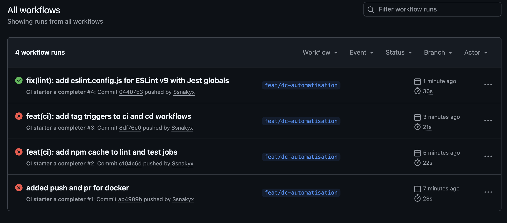

# Rapport d'incident — CI-001

**Date :** 2026-06-10
**Impact :** La CI bloquait tous les pushes sur la branche

---

## Ce qui s'est passé

Dès le premier run, le job de lint échouait en moins de 30 secondes avec un message indiquant qu'aucun fichier de configuration ESLint n'était trouvé.

## Pourquoi

La version d'ESLint utilisée (v9) ne reconnaît plus l'ancien format de configuration `.eslintrc`. Elle attend un fichier `eslint.config.js`. Ce fichier n'existait pas dans le projet, donc ESLint ne savait pas quoi faire et plantait immédiatement.

## Comment c'a été résolu

Création du fichier `api/eslint.config.js` avec les bonnes règles pour les fichiers source et pour les fichiers de tests. Après ce correctif, tous les runs suivants sont passés.

## Leçon retenue

Tester `npm run lint` en local avant le premier push pour éviter de découvrir ce type de problème directement en CI.
